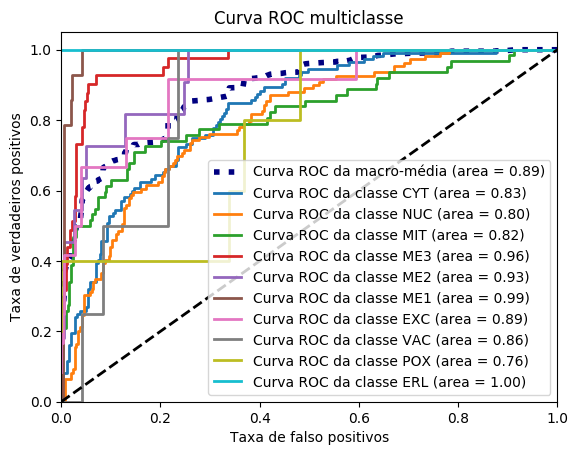
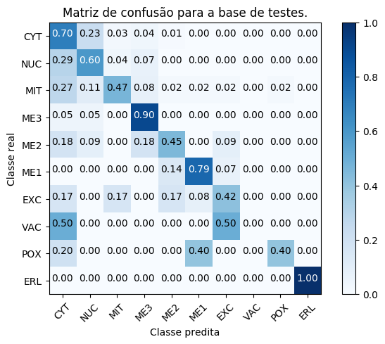
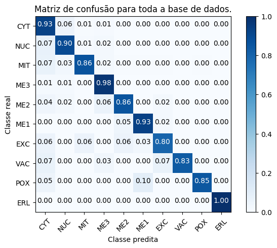

Initializing the Yeast dataset from UCI.

```{r}
yeast <- read.csv("https://archive.ics.uci.edu/ml/machine-learning-databases/yeast/yeast.data",
                  sep="",
                  header=F,
                  col.names=c("name", "mcg", "gvh", "alm", "mit", "erl", "pox", "vac", "nuc", "class"))
yeast
```

Lets plot a matrix for paramters comparison and correlation checking:

```{r myplot,fig.width=8,fig.height=9,dpi=300,out.width="1920px",out.height="2160px",echo=FALSE,results='hide',fig.keep='all'}
library('ggplot2')
library('GGally')

my_bin <- function(data, mapping, ..., low = "#132B43", high = "#56B1F7") {
  ggplot(data = data, mapping = mapping) +
    geom_bin2d(...) +
    scale_fill_gradient(low = low, high = high)
}

ggpairs(yeast, columns=2:10, lower=list(continuous=my_bin), binwidth=10) + theme(
  axis.text = element_text(size = 5),
  axis.title = element_text(size = 5),
  legend.background = element_rect(fill = "white"),
  panel.grid.major = element_line(colour = NA),
  panel.grid.minor = element_blank(),
  panel.background = element_rect(fill = "grey95"))
```
Lets now load the data-set in python
```{python}
import numpy as np
import sklearn
import sklearn.model_selection

classes = {
    "CYT": 0,
    "NUC": 1,
    "MIT": 2,
    "ME3": 3,
    "ME2": 4,
    "ME1": 5,
    "EXC": 6,
    "VAC": 7,
    "POX": 8,
    "ERL": 9
}

data = np.genfromtxt("https://archive.ics.uci.edu/ml/machine-learning-databases/yeast/yeast.data", dtype="|U5", autostrip=True)
X = np.asarray(data[:, 1:-1], dtype=np.float64)
y = [classes[k] for k in data[:, -1]]

X_train, X_test, y_train, y_test = sklearn.model_selection.train_test_split(X, y, random_state=1)
```

In this Python snippet we create a classifier using auto machine learning with auto-sklearn:

```{python}
import autosklearn.classification
import autosklearn.metrics
import sklearn.datasets
import sklearn.metrics

from sklearn.externals import joblib
from time import gmtime, strftime
automl = autosklearn.classification.AutoSklearnClassifier(
    time_left_for_this_task=60 * 60,
    per_run_time_limit=60 * 6) 
    
automl.fit(X_train, y_train)
joblib.dump(automl, './automl-model.pkl')
```

Lets load the trained model:

```{python}
import scipy
from sklearn.externals import joblib
import autosklearn
import numpy as np
import sklearn
import sklearn.model_selection
from sklearn.metrics import confusion_matrix
import matplotlib.pyplot as plt
import itertools
from scipy import interp
import pandas as pd

classes = {
    "CYT": 0,
    "NUC": 1,
    "MIT": 2,
    "ME3": 3,
    "ME2": 4,
    "ME1": 5,
    "EXC": 6,
    "VAC": 7,
    "POX": 8,
    "ERL": 9
}

attrs = ["name", "mcg", "gvh", "alm", "mit", "erl", "pox", "vac", "nuc", "class"]

def plot_confusion_matrix(cm, classes,
                          normalize=False,
                          title='Confusion matrix',
                          cmap=plt.cm.Blues):
    """
    This function prints and plots the confusion matrix.
    Normalization can be applied by setting `normalize=True`.
    """
    if normalize:
        cm = cm.astype('float') / cm.sum(axis=1)[:, np.newaxis]
        print("Normalized confusion matrix")
    else:
        print('Confusion matrix, without normalization')

    print(cm)

    plt.imshow(cm, interpolation='nearest', cmap=cmap)
    plt.title(title)
    plt.colorbar()
    tick_marks = np.arange(len(classes))
    plt.xticks(tick_marks, classes, rotation=45)
    plt.yticks(tick_marks, classes)

    fmt = '.2f' if normalize else 'd'
    thresh = cm.max() / 2.
    for i, j in itertools.product(range(cm.shape[0]), range(cm.shape[1])):
        plt.text(j, i, format(cm[i, j], fmt),
                 horizontalalignment="center",
                 color="white" if cm[i, j] > thresh else "black")

    plt.tight_layout()
    plt.ylabel('Classe real')
    plt.xlabel('Classe predita')

to_use = ["mcg", "gvh", "alm", "mit", "erl", "pox", "vac", "nuc", "class"]

data = pd.read_csv("https://archive.ics.uci.edu/ml/machine-learning-databases/yeast/yeast.data", sep="\s+", usecols=to_use, names=attrs, converters={
    9: lambda c: classes[c]
})

X = data[to_use[:-1]]
y = data[to_use[-1]]

X_train, X_test, y_train, y_test = sklearn.model_selection.train_test_split(X, y, random_state=1)
automl_csf = joblib.load('/Users/mateus/dev/automl/projeto-mineracao/automl-2017-08-14 18:38:46.pkl')

y_test_pred = automl_csf.predict(X_test)
y_test_pred_prob = automl_csf.predict_proba(X_test)
y_pred = automl_csf.predict(X)
y_pred_prob = automl_csf.predict_proba(X)

# Compute ROC curve and ROC area for each class
fpr = dict()
tpr = dict()
roc_auc = dict()
n_classes = len(classes)
for c, i in classes.items():
    fpr[i], tpr[i], _ = sklearn.metrics.roc_curve(y_test, y_test_pred_prob[:, i], pos_label=i)
    roc_auc[i] = sklearn.metrics.auc(fpr[i], tpr[i])

# Compute macro-average ROC curve and ROC area

# First aggregate all false positive rates
all_fpr = np.unique(np.concatenate([fpr[i] for i in range(n_classes)]))

# Then interpolate all ROC curves at this points
mean_tpr = np.zeros_like(all_fpr)
for c, i in classes.items():
    mean_tpr += interp(all_fpr, fpr[i], tpr[i])

# Finally average it and compute AUC
mean_tpr /= n_classes

fpr["macro"] = all_fpr
tpr["macro"] = mean_tpr
roc_auc["macro"] = sklearn.metrics.auc(fpr["macro"], tpr["macro"])

# Plot all ROC curves
plt.figure()
plt.plot(fpr["macro"], tpr["macro"],
         label='Curva ROC da macro-média (area = {0:0.2f})'
               ''.format(roc_auc["macro"]),
         color='navy', linestyle=':', linewidth=4)
lw = 2
for c, i in classes.items():
    plt.plot(fpr[i], tpr[i], lw=lw,
             label='Curva ROC da classe {0} (area = {1:0.2f})'
                   ''.format(c, roc_auc[i]))

plt.plot([0, 1], [0, 1], 'k--', lw=lw)
plt.xlim([0.0, 1.0])
plt.ylim([0.0, 1.05])
plt.xlabel('Taxa de falso positivos')
plt.ylabel('Taxa de verdadeiros positivos')
plt.title('Curva ROC multiclasse')
plt.legend(loc="lower right")
plt.savefig('roc.png', bbox_inches='tight')

print(y_test_pred_prob)

print(automl_csf.show_models())
print("Accuracy score", sklearn.metrics.accuracy_score(y_test, y_test_pred))
print("Kappa Score", sklearn.metrics.cohen_kappa_score(y_test, y_test_pred))
print("F-score", sklearn.metrics.f1_score(y_test, y_test_pred, average="macro"))

plt.figure()
plot_confusion_matrix(confusion_matrix(y_test, y_test_pred), classes=classes.keys(), normalize=True,
                      title='Matriz de confusão para a base de testes.')
plt.savefig('confusion_matrix.png', bbox_inches='tight')

plt.figure()
plot_confusion_matrix(confusion_matrix(y, y_pred), classes=classes.keys(), normalize=True,
                      title='Matriz de confusão para toda a base de dados.')
plt.savefig('confusion_matrix_all.png', bbox_inches='tight')
```





